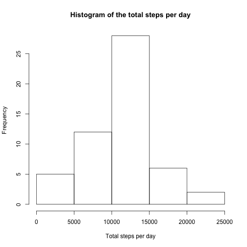
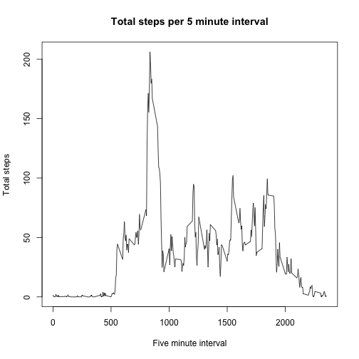
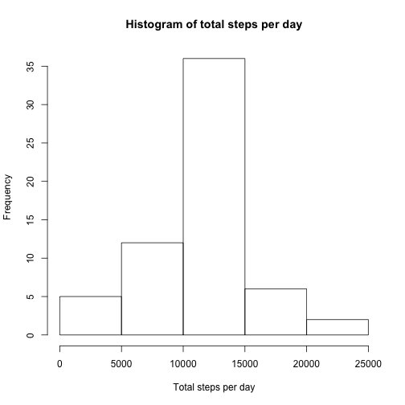
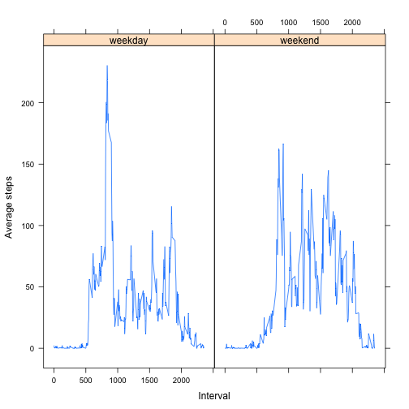

# Peer Assessment 1: R markdown file
## Grab the librarys needed and read in data

```r
library(lubridate)
library(reshape2)
library(tidyr)
library(dplyr)
library(plyr)
library(chron)
activity.tab <- read.table("activity.csv", header=TRUE, sep=",")
```
## Some preprocessing: Pad front of numbers with zeroes for format time reading

```r
activity.tab$interval <- sprintf("%04d", activity.tab$interval)
```

## Q1: What is mean total number of steps taken per day?
### Use only non-NA cases

```r
data <- activity.tab[complete.cases(activity.tab),]
```
### Make a histogram of the total number of steps taken each day

```r
total.steps.per.day <- data %>% group_by(date) %>% dplyr::summarise(total.steps=sum(steps))
hist(total.steps.per.day$total.steps, xlab = "Total steps per day", main = "Histogram of the total steps per day")
```

 

### Calculate and report the mean and median total number of steps taken per day

```r
mean.total.steps <- mean(total.steps.per.day$total.steps)
median.total.steps <- median(total.steps.per.day$total.steps)
```
The mean total steps is 1.0766189 &times; 10<sup>4</sup> and the median is 10765.

## Q2. What is the average daily activity pattern?
### Make a time series plot (i.e. type = "l") of the 5-minute interval (x-axis) and the average number of steps taken, averaged across all days (y-axis)

```r
steps.per.interval <- data %>% group_by(interval) %>% dplyr::summarise(total.steps=mean(steps))
plot(steps.per.interval$interval, steps.per.interval$total.steps, type="l", xlab = "Five minute interval", ylab = "Total steps", main="Total steps per 5 minute interval")
```

 
Which 5-minute interval, on average across all the days in the dataset, contains the maximum number of steps?

```r
maxsteps <- steps.per.interval$interval[which(steps.per.interval$total.steps == max(steps.per.interval$total.steps))]
```
The interval with the maximum total steps is 0835.

## Q3. Imputing missing values
Note that there are a number of days/intervals where there are missing values (coded as NA). The presence of missing days may introduce bias into some calculations or summaries of the data.
### Calculate and report the total number of missing values in the dataset (i.e. the total number of rows with NAs)

```r
num.missing.values <- length(which(complete.cases(activity.tab)==FALSE))
```
Number of missing values: 2304.

### Devise a strategy for filling in all of the missing values in the dataset. 
The strategy does not need to be sophisticated. For example, you could use the mean/median for that day, or the mean for that 5-minute interval, etc.

The strategy I chose was to Assume that activity patterns per interval are similar day by day. Fill missing values with the mean of the activities for that interval from rest of days.

### Create a new dataset that is equal to the original dataset but with the missing data filled in.

```r
impute.data <- activity.tab
for(i in 1:nrow(impute.data)) {
  if (is.na(impute.data$steps[i])) {
    impute.data$steps[i] <- steps.per.interval$total.steps[which(steps.per.interval$interval == impute.data$interval[i])]
  }
}
```

### Make a histogram of the total number of steps taken each day and Calculate and report the mean and median total number of steps taken per day. 
Do these values differ from the estimates from the first part of the assignment? What is the impact of imputing missing data on the estimates of the total daily number of steps?

The histogram for the imputed values is enriched in the "average" number of steps, with little to no change to the more extreme values.


```r
impute.steps.per.day <- impute.data %>% group_by(date) %>% dplyr::summarise(total.steps=sum(steps))
hist(impute.steps.per.day$total.steps, xlab = "Total steps per day", main="Histogram of total steps per day")
```

 

```r
impute.mean <- mean(impute.steps.per.day$total.steps)
impute.median <- median(impute.steps.per.day$total.steps)
```
The mean and median total steps after imputing the data are 1.0766189 &times; 10<sup>4</sup> and 1.0766189 &times; 10<sup>4</sup>, respectively.

## Are there differences in activity patterns between weekdays and 
For this part the weekdays() function may be of some help here. Use the dataset with the filled-in missing values for this part.

```r
impute.data$day <- weekdays(as.Date(impute.data$date))
```

### Create a new factor variable in the dataset with two levels -- "weekday" and "weekend" indicating whether a given date is a weekday or weekend day.

```r
impute.data$wd <- "weekday"
impute.data$wd[is.weekend(impute.data$date)] <- "weekend"
impute.data$wd <- factor(impute.data$wd)
```

###. Make a panel plot
Make a plot containing a time series plot (i.e. type = "l") of the 5-minute interval (x-axis) and the average number of steps taken, averaged across all weekday days or weekend days (y-axis).

```r
library(lattice)
x <- impute.data %>% group_by(wd, interval) %>% dplyr::summarise(steps=mean(steps))
xyplot(steps ~ as.numeric(interval) | factor(wd), data=x, type="l", xlab = "Interval", ylab = "Average steps")
```

 

Weekdays show a behavior of a lot of steps in the morning, presumably for going to work, followed by a lower number of steps per interval, while the weekend peak number of steps per interval starts later around 1000, with more frequent steps per interval throughout the day, also ending later in the day.
